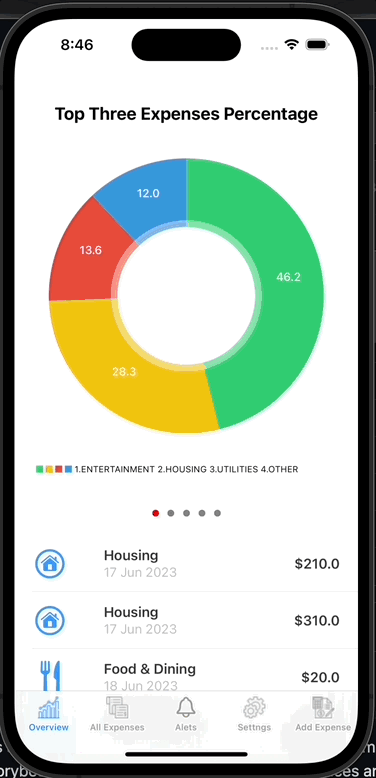

# ExpenseTracker

A native iOS Application developed to as a solution to the problem of finance tracking and management. The application is written in swift and iOS Storyboarding
along with the use of various services and frameworks such as Cocoa, SwiftChart, along with the use of SQLite Database for presistant data storage. 
Currently only available in English. The requirements for the application was devised from thorough market research and a user driven iterative development lifecycle was maintained 
throughout the timeline of the project. Upon implementation of a set of functionalities, users were consulted and based on feedback, various improvements
to exisiting functionalties and addition of newer ones were incorporated into the application. The appliaction, at the current stage, sits at the
3rd iteration.

# Functionalities
- ## Minimalistic and Simplified UI Design
The application was designed to be simple to use and not having any complex UI features. A tab based naviation allows easier traversing across
various sections of the application. All views consist of simplified UI elements to provide for both faster adaptability in using the app along
with easier accessability and easier usability.
- ## Adding Expenses
Users can add expenses into the system by accessing the Add Expense form and adding various data regarding their expenses. Upon submitting the form,
the expense is added into a persistance storage for future referencing and analytics.
- ## Save Photo of Expenditure Documents
Users can capture an image of expense documents (receipt, invoice, etc) in order to keep a record along with an expense that they intend to add into
the system. This functionality in available withint the form itself where the user can tap on the image box which opens up the camera and they can
take an image, crop and add it to the expense. 
**(IMPORTANT : This functionality requires an actual device since emulators tend not to have cameras and requires user permission to use the camera function of their device)**
- ## Expenses List and Detailed Expenses View
THe user can view a list of all expenses added to the system with the date of the expenditure, cateogory and amount spent in a tabulature form. Upon
clicking any of the items in the list, users are navigated to a view where they can view the details for the expense along with any images they saved.
- ## Basic Expenditure Analytics
Based on the added expenditures, users are provided with thrends of their expenditure in the overview tab (landing page) of the application. Users
are provided with 2 Charts (Pie Chart and Bar Chart) which provides category-amounts expendtiure analysis, depicting visualizations of their expendture
along with the timeline.
- ## Mostly Expenditure Threshold
Users can set a monthly expenditure threshold in the settings page in order to allow the system to alert them in keeping track of their expenses for
the current month.
- ## Alerts and Alerts List
Based on the threshold that users set, users are notified once they are nearly reaching their threshold. The alert keeps generating if users keep
adding expenditures and the sum exceeds the threshold. The alerts are displayed in a tabulature format with each alert depicting the date of the
alert, the total amount spent by the user for that particular month, and the amount left to be spent for the month based on the threshold. The
alerts are in-app.

# Future Upgrades
- Authentication
- Cloud-based database
- Complex analytics (More chart variations and analytics metrics)
- Recent Expenditures
- Reports (Monthly, Yearly) 
- Customizable alerts and Push Notifications
- Support for more languages

 # Application Demo:
 A short gif demonstrating the game in action:  
  
  
 

# How to Run

At the current stage, the application has not been deployed in the AppStore and hence there is no way to download it or run it natively in
a iPhone. Hence, the only way to run it is through Xcode from a Mac device and use an emulator or connect an iPhome to use the application.
Note: Open the app in XCode by clicking on the .xcworkspace.

